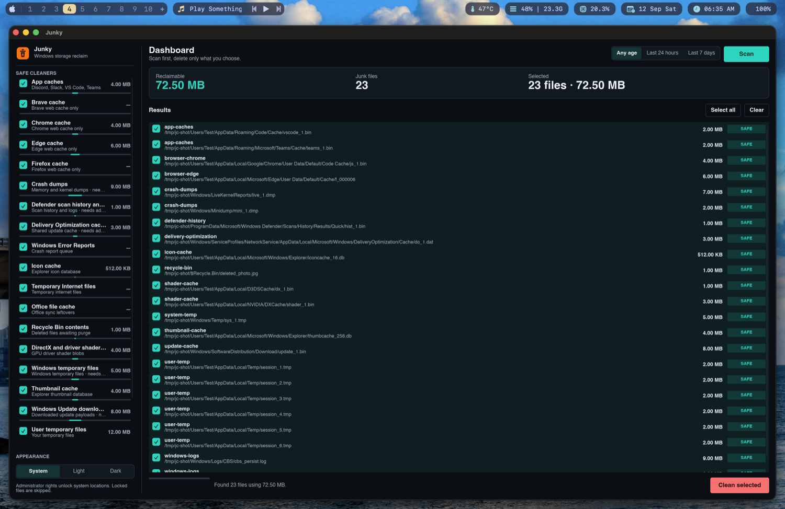
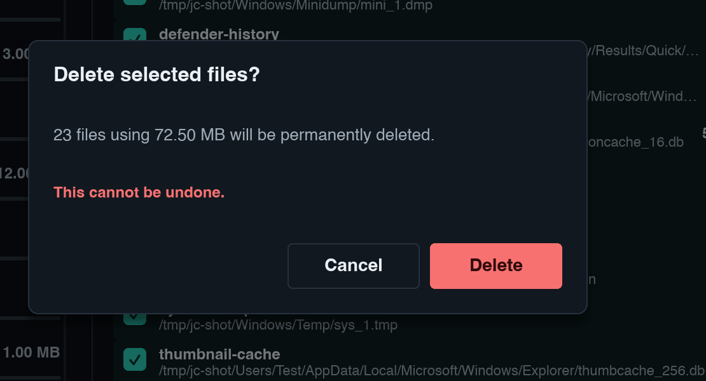

<div align="center">
  
  <h1>Junky</h1>
  <p><strong>Reclaim gigabytes of Windows disk space, safely.</strong></p>
  <p>A junk cleaner that scans first and asks before deleting anything.<br>Calm native UI. No guesswork.</p>
  <p>
    <a href="https://github.com/wthrajat/junky/releases/latest"></a>
    <a href="https://github.com/wthrajat/junky/actions/workflows/rust.yml"></a>
    <a href="LICENSE"></a>
  </p>
  <p><a href="https://github.com/wthrajat/junky/releases/latest"><strong>Download for Windows</strong></a></p>
</div>

## Download

* Grab **`junky-gui.exe`** from the [latest release](https://github.com/wthrajat/junky/releases/latest) (or `junky.exe` for the command line).
* Run it. The build is unsigned, so SmartScreen asks once. Choose More info, then Run anyway.
* Pick categories, press **Scan**, review, then **Clean**.

Portable, no installer. Admin rights unlock system locations. Everything else works as a normal user.

<p align="center">
  
  <br>
  <em>Scan results with per file selection and size badges.</em>
</p>
<p align="center">
  
  <br>
  <em>The confirm step lists exactly what will go.</em>
</p>

## Why Junky

* **Scan first, always.** You see every file and its size before anything is deleted.
* **Targeted cleanup.** Junky empties known junk locations instead of sweeping the whole drive for file extensions.
* **Skips what is busy.** Locked files are left alone, so updates and apps never break while cleaning.
* **Small and offline.** A native app with no installer, no account, and no telemetry.

## Safety first

* The optional deep clean stays off unless you turn it on.
* Core Windows locations are never touched: System32, WinSxS, Installer, the update database, and Recovery.
* Shortcuts are never followed. Every clean shows a preview and asks for confirmation.

## What's inside

Junky covers the usual suspects: temporary folders, Windows Update leftovers, the Recycle Bin, thumbnail and icon caches, browser caches, app caches for tools like Office, Teams, Discord, Slack, and VS Code, plus crash reports and logs.

For machines that need more, an optional deep clean handles previous Windows installs, prefetch data, stray temp files, and the font cache.

## Prefer the terminal

```console
junky scan --include-aggressive --older-than-hours 24
junky clean --yes
```

## Development

See [docs/development.md](docs/development.md) for setup, testing, and how releases are built.

## License

MIT. See [LICENSE](LICENSE).
